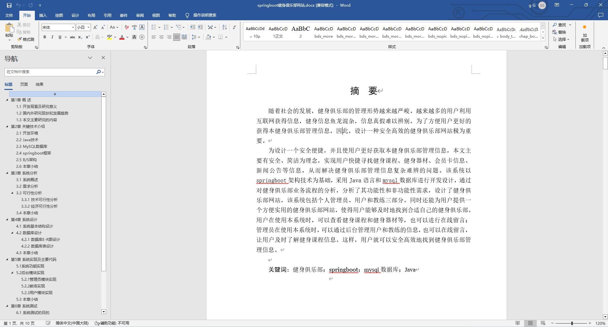
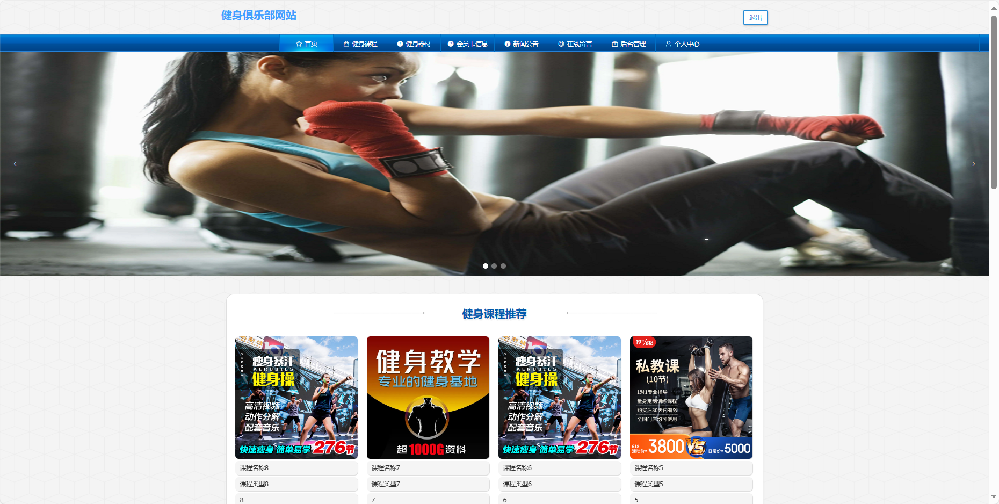
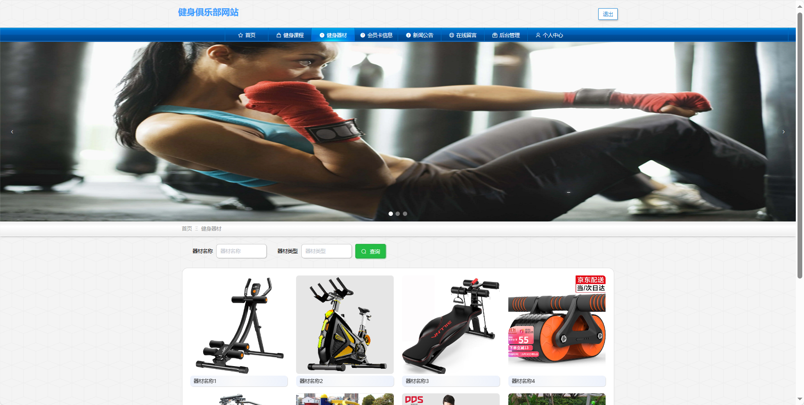
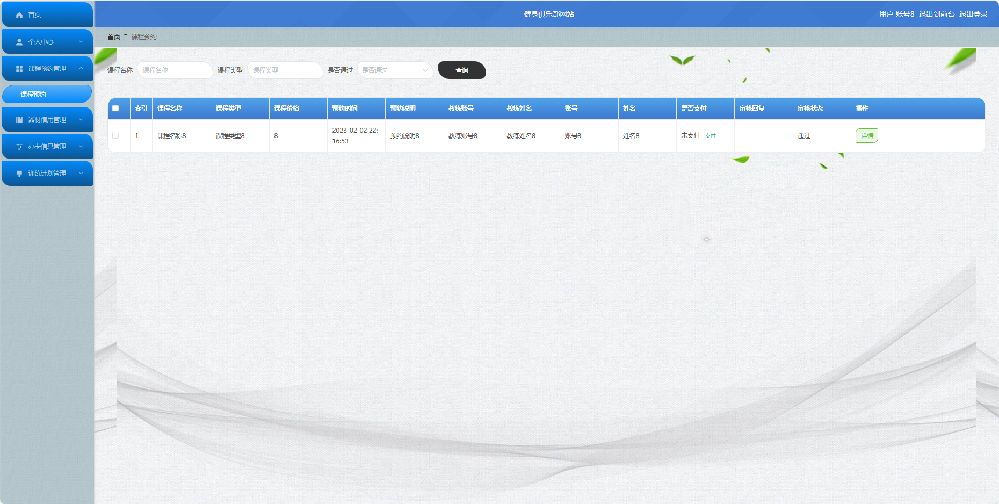
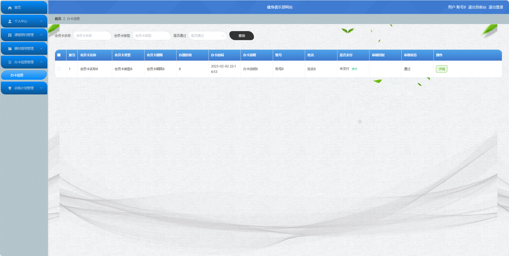
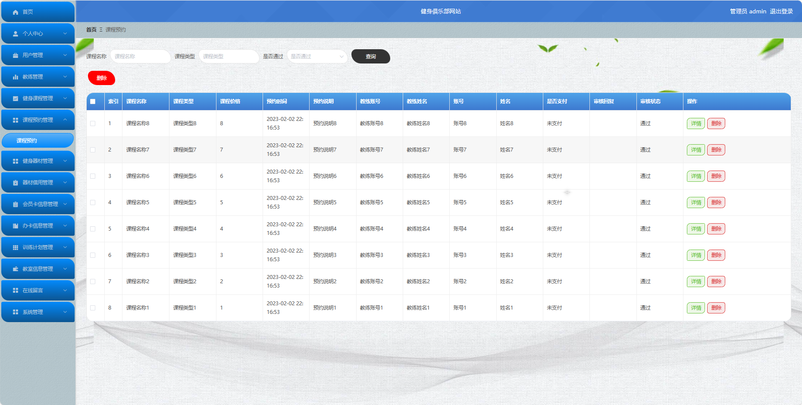
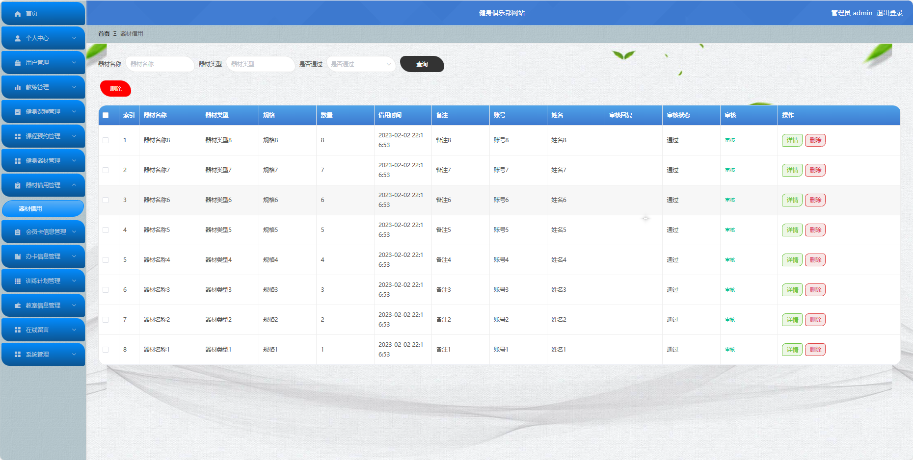

## 基于SpringBoot的健身俱乐部网站(程序+报告)

###  获取sql数据库文件: 从戎源码网 (https://armycodes.com/) QQ: 386869957 QQ群: 377586148
###  所有系统地址: (https://github.com/YuLin-Coder/AllProjectCatalog) 
###  所有项目以及源代码本人均调试运行无问题 可支持远程安装部署调试、定制修改、代码讲解

## 项目介绍
基于SpringBoot的健身俱乐部网站，系统包含三种角色：管理员、学员,教练主要功能如下。

【学员功能】

1. **首页：** 浏览健身俱乐部的最新信息。
2. **健身课程：** 查看健身课程的时间表和详情，进行预约。
3. **健身器材：** 浏览俱乐部提供的健身器材信息。
4. **会员卡信息：** 查看个人会员卡的信息和权益。
5. **新闻公告：** 获取俱乐部的最新新闻和公告。
6. **在线留言：** 在留言板上留言或查看其他学员的留言。
7. **后台管理：**
   - **首页：** 查看概况。
   - **个人中心：** 管理个人信息，包括修改密码。
   - **课程预约管理：** 查看和管理个人的课程预约。
   - **器材借用管理：** 查看和管理个人的器材借用情况。
   - **办卡信息管理：** 查看和管理个人的办卡信息。
   - **训练计划管理：** 查看和管理个人的训练计划。

8. **个人中心：** 管理个人信息，包括修改密码和查看个人的健身记录。

【管理员功能】

1. **首页：** 查看整体系统的概况和关键数据。
2. **个人中心：** 修改密码和管理个人信息。
3. **用户管理：** 管理学员的账号信息，包括审核注册。
4. **教练管理：** 管理教练的信息。
5. **健身课程管理：** 管理健身课程。
6. **课程预约管理：** 查看和处理学员的课程预约申请。
7. **健身器材管理：** 管理健身器材的信息。
8. **器材借用管理：** 查看和管理学员的器材借用情况。
9. **会员卡信息管理：** 查看和管理学员的会员卡信息。
10. **办卡信息管理：** 查看和管理学员的办卡信息。
11. **训练计划管理：** 查看和管理学员的训练计划。
12. **教室信息管理：** 管理健身课程的教室信息。
13. **在线留言：** 查看和管理学员的留言。
14. **系统管理：**
    - **关于我们：** 编辑俱乐部的介绍信息。
    - **系统简介：** 提供对系统的简要说明。
    - **轮播图管理：** 管理网站首页的轮播图。
    - **新闻公告：** 发布和管理俱乐部的新闻和公告。

【教练功能】

1. **首页：** 查看健身房信息。
2. **健身课程：** 查看和管理自己负责的健身课程。
3. **健身器材：** 查看和管理使用的健身器材。
4. **会员卡信息：** 查看和管理学员的会员卡信息。
5. **新闻公告：** 查看最新的俱乐部新闻和公告。
6. **在线留言：** 参与留言板。
7. **后台管理：**
   - **首页：** 查看概况。
   - **个人中心：** 管理个人信息，包括修改密码。
   - **课程预约管理：** 查看和管理学员对课程的预约。
   - **训练计划管理：** 查看和管理学员的训练计划。

8. **个人中心：** 管理个人信息，

## 项目技术
- 编程语言：Java
- 数据库：MySQL
- 项目管理工具：Maven
- 前端技术：HTML、CSS、JavaScript、Jquery、Vue
- 后端技术：Spring、SpringMVC、MyBatis

## 运行环境
- JDK版本：JDK1.8及以上
- 开发工具：IDEA、Ecplise、Myecplise都可以
- 数据库: MySQL5.7及以上
- Maven：maven3.0及以上
- Node：14.14.0及以上

## 运行截图

